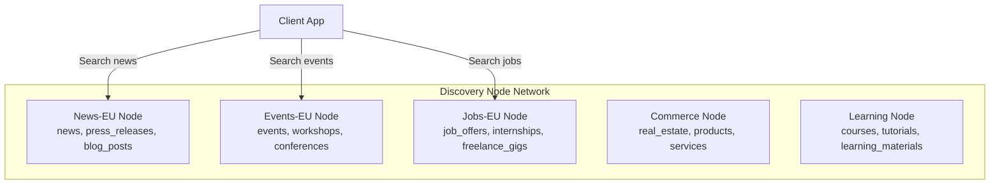
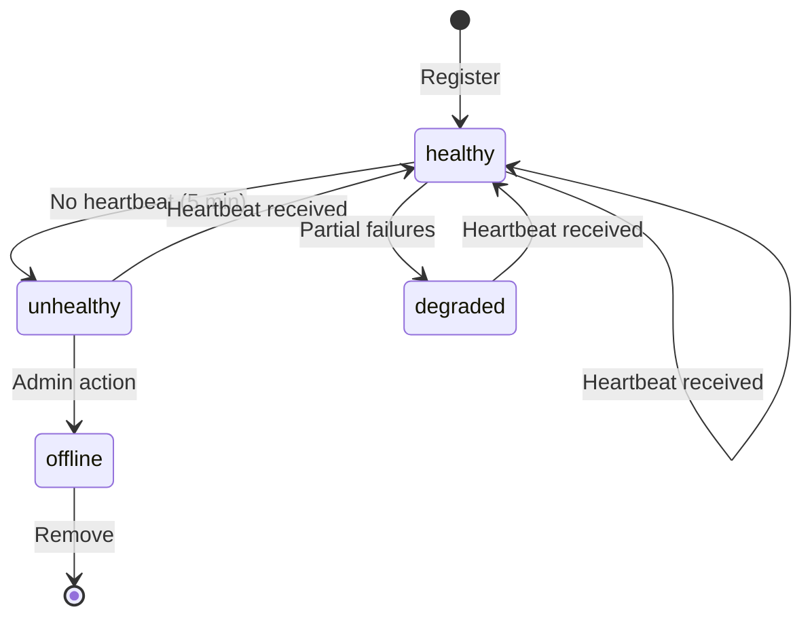

Discovery Nodes are designed to operate as a **federated network**. Each node can specialize in specific content types or geographic regions, and clients query a node directory to find the right node for their needs.

## Node specialization

To distribute load and maintain performance, each Discovery Node supports a limited set of content types:



This architecture means:
- Each node maintains smaller, more focused indices
- Content-type-specific optimizations (analyzers, facets) are isolated
- Nodes can scale independently based on demand

## Node directory

Every Discovery Node maintains a **peer directory** — a list of other known nodes in the network. The directory is exposed via a public API endpoint.

### Querying the directory

```bash
curl https://discover.roadbeat.net/api/v1/nodes
```

```json
{
  "nodes": [
    {
      "node_id": "news-eu-1",
      "endpoint": "https://news-eu.roadbeat.net",
      "content_types": ["news", "press_releases"],
      "regions": ["EU"],
      "status": "healthy",
      "latency_hint_ms": 25,
      "last_seen": "2026-03-10T09:55:00Z"
    },
    {
      "node_id": "events-eu-1",
      "endpoint": "https://events-eu.roadbeat.net",
      "content_types": ["events", "workshops"],
      "regions": ["EU"],
      "status": "healthy",
      "latency_hint_ms": 30,
      "last_seen": "2026-03-10T09:54:00Z"
    }
  ]
}
```

<Callout kind="info">
  The public directory only returns nodes with status `healthy` or `degraded`. Admin endpoints show all nodes including offline ones.
</Callout>

### Registering a peer node

Node registration is an admin operation requiring the `X-Admin-Key` header:

```bash
curl -X POST https://discover.roadbeat.net/api/v1/nodes/register \
  -H "X-Admin-Key: YOUR_ADMIN_KEY" \
  -H "Content-Type: application/json" \
  -d '{
    "node_name": "Events EU",
    "endpoint": "https://events-eu.roadbeat.net",
    "content_types": ["events", "workshops", "conferences"],
    "regions": ["EU"],
    "operator_name": "roadbeat Foundation",
    "operator_email": "ops@roadbeat.net"
  }'
```

## Heartbeat protocol

Peer nodes send periodic heartbeat signals to announce their liveness. The heartbeat can optionally include a stats snapshot.

```bash
curl -X POST https://discover.roadbeat.net/api/v1/nodes/news-eu-1/heartbeat \
  -H "Content-Type: application/json" \
  -d '{
    "stats": {
      "total_documents": 5234567,
      "total_publishers": 42,
      "uptime_percent": 99.97
    }
  }'
```

### Stale node detection

A background scheduler checks for stale nodes every minute:

- Nodes with no heartbeat for **5+ minutes** are marked `unhealthy`
- Unhealthy nodes are hidden from the public directory
- Nodes can recover by sending a new heartbeat (status resets to `healthy`)

## Node lifecycle



## Federated search

Client applications that need to search across multiple content types perform **federated search** by querying multiple nodes in parallel:

<Steps>
  <Step title="Query the directory">
    The client fetches the node directory to discover which nodes serve which content types.
  </Step>
  <Step title="Route queries">
    Based on the requested content types, the client sends search requests to the appropriate nodes in parallel.
  </Step>
  <Step title="Merge results">
    Results from all nodes are merged, deduplicated by teaser ID, and ranked by score.
  </Step>
  <Step title="Cache the directory">
    The node directory is cached client-side (5-minute TTL recommended) to avoid repeated lookups.
  </Step>
</Steps>

<Callout kind="tip">
  The roadbeat consumer applications (Web Client, Studio consumer module) handle federated search automatically via their `DiscoverService`. You only need to manage federation manually if building a custom client.
</Callout>

## Admin operations

All node management operations require the `X-Admin-Key` header:

| Operation | Method | Endpoint |
|-----------|--------|----------|
| List all nodes (incl. offline) | `GET` | `/api/v1/nodes/all` |
| Get node details | `GET` | `/api/v1/nodes/:nodeId` |
| Register peer node | `POST` | `/api/v1/nodes/register` |
| Update node info | `PUT` | `/api/v1/nodes/:nodeId` |
| Remove node | `DELETE` | `/api/v1/nodes/:nodeId` |
| Send heartbeat | `POST` | `/api/v1/nodes/:nodeId/heartbeat` |
