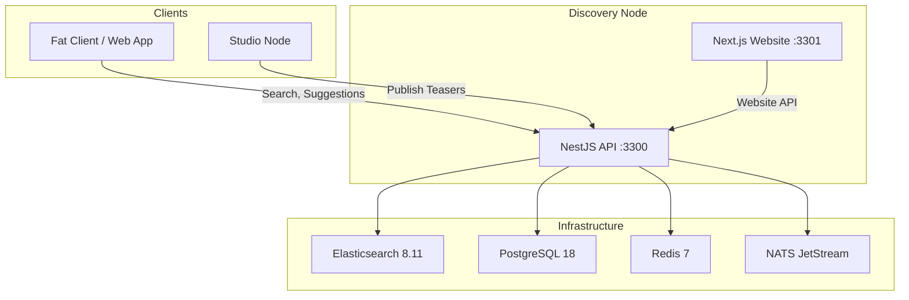
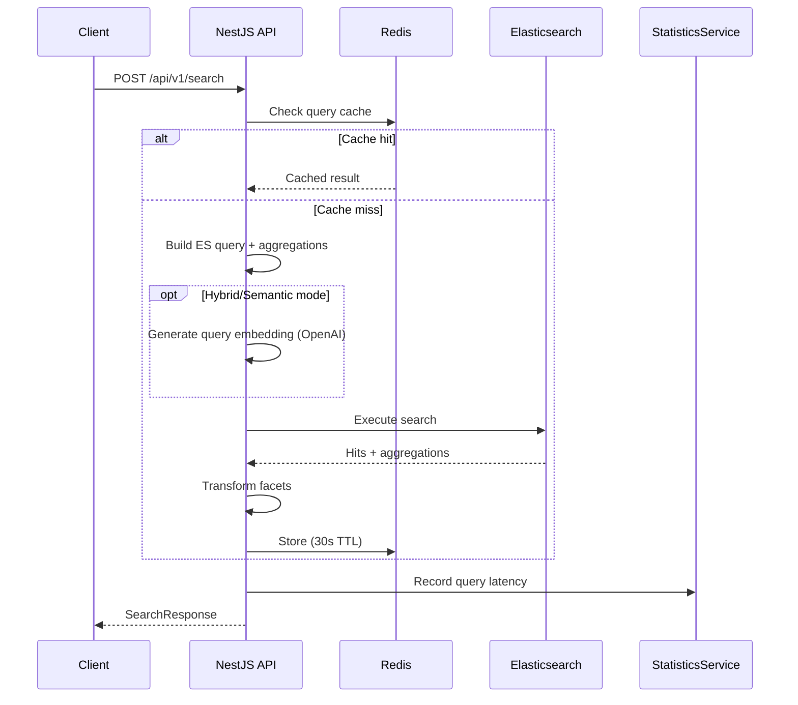
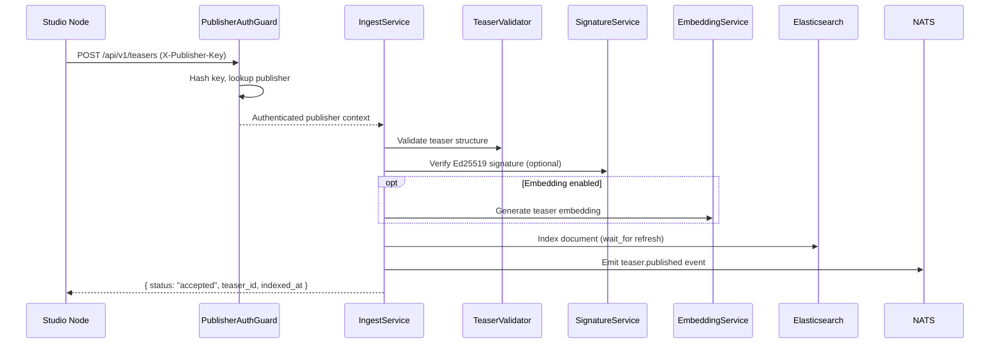

A Discovery Node is composed of a NestJS API backend, a Next.js transparency website, and four infrastructure services. This page describes how the components fit together.

## High-level overview

## API modules

The NestJS API is organized into 16 modules, each handling a distinct responsibility:

| Module | Routes | Description |
|--------|--------|-------------|
| **SearchModule** | 3 | BM25 + kNN hybrid search, goal-based search, autocomplete suggestions |
| **FacetsModule** | — | 11 global + 4 content-type-specific facet definitions and aggregation transformation |
| **IngestModule** | 5 | Teaser publish, update, delete, get, batch operations |
| **PublishersModule** | 8 | Publisher registration, verification, management, key rotation, suspension |
| **NodesModule** | 7 | Peer node directory, registration, heartbeat, federation |
| **StatisticsModule** | 5 | Query metrics, daily stats aggregation, dashboard data |
| **AdminModule** | 9 | Node config, cache management, Elasticsearch admin, incidents |
| **EmbeddingModule** | 4 | Semantic vector search, document similarity, embedding refresh |
| **WebsiteModule** | 7 | Read-only endpoints for the public transparency website |
| **HealthModule** | 2 | Liveness and readiness probes |
| **ElasticsearchModule** | — | ES client, index templates, health checks |
| **CacheModule** | — | Redis client with get/set/del operations |
| **EventsModule** | — | NATS JetStream pub/sub for internal events |
| **SignatureModule** | — | Ed25519 signature verification and checksum generation |
| **PrismaModule** | — | PostgreSQL database access via Prisma ORM |
| **RateLimitingModule** | — | Per-publisher Redis sliding window rate limiter |

## Infrastructure services

<Tabs>
  <Tab title="Elasticsearch" icon="search">
    **Purpose**: Content indexing and search

    - Stores all teaser documents in content-type-specific indices (`roadbeat-content-{type}`)
    - Provides BM25 full-text search with language-specific analyzers (German, English)
    - Supports kNN vector search for semantic similarity via `dense_vector` fields
    - Faceted aggregations power the filter UI
    - Index template (`roadbeat-content`) is auto-created on startup

    **Port**: 9200
  </Tab>

  <Tab title="PostgreSQL" icon="database">
    **Purpose**: Metadata storage

    PostgreSQL stores relational data that doesn't belong in the search index:

    - **Publishers** — registration, verification, API keys, rate limits
    - **Node config** — node identity, operator info, legal content
    - **Daily stats** — aggregated snapshots for historical charts
    - **Incidents** — health status page incident tracking
    - **Discovery nodes** — peer node directory for federation

    **Port**: 5432
  </Tab>

  <Tab title="Redis" icon="zap">
    **Purpose**: Caching layer

    - Search result cache (30-second TTL)
    - Suggestion cache (60-second TTL)
    - Node directory cache (5-minute TTL)
    - Embedding vector cache for queries (1-hour TTL)
    - Per-publisher rate limit counters (sliding window)

    **Port**: 6379
  </Tab>

  <Tab title="NATS" icon="radio">
    **Purpose**: Event streaming

    - Internal event bus for teaser lifecycle events (`teaser.published`, `teaser.updated`, `teaser.unpublished`)
    - Node health events for federation
    - JetStream provides durable message delivery

    **Port**: 4222 (client), 8222 (monitoring)
  </Tab>
</Tabs>

## Request flow

### Search request

### Ingest request

## Security layers

| Layer | Mechanism |
|-------|-----------|
| **HTTP headers** | Helmet (HSTS, X-Frame-Options, X-Content-Type-Options, CSP in production) |
| **Rate limiting** | @nestjs/throttler: 120 req/min/IP globally |
| **Publisher auth** | SHA-256 hashed API keys via `X-Publisher-Key` header |
| **Admin auth** | SHA-256 hashed admin key via `X-Admin-Key` with constant-time comparison |
| **Signature verification** | Ed25519 for publisher content signing |
| **Input validation** | class-validator DTOs with whitelist + forbidNonWhitelisted |
| **CORS** | Configurable origins via `CORS_ORIGIN` environment variable |
| **Compression** | gzip for all responses > 1 KB |
