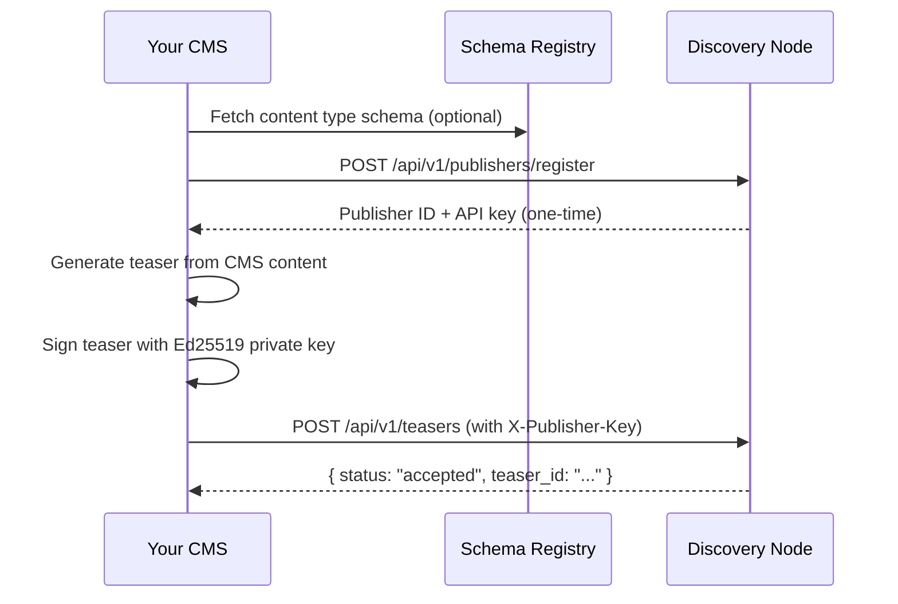
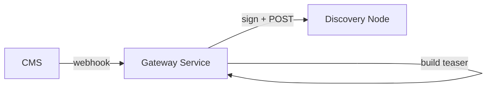
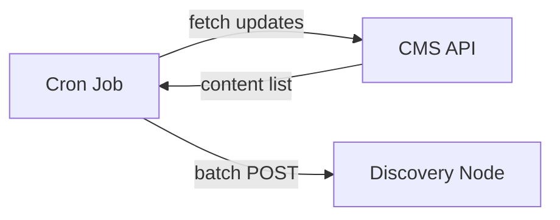

The roadbeat **Gateway API** lets you publish structured content teasers directly to one or more Discovery Nodes from any CMS or backend system. No roadbeat Studio installation is required — your existing CMS becomes a first-class publisher in the roadbeat ecosystem.

<Callout kind="info">
  This guide is for developers integrating an **external CMS** (WordPress, Drupal, custom systems, etc.) with roadbeat. If you already run a roadbeat Studio instance, publishing is handled automatically — see the [Content Ingest](/features/ingest) docs instead.
</Callout>

## How it works



Your CMS pushes lightweight **teasers** (summaries) to Discovery Nodes. The full content stays on your servers. Users discover your content through the roadbeat ecosystem and click through to your site.

## Prerequisites

Before you start, you need:

- A public domain you control (for verification)
- An Ed25519 key pair (instructions below)
- Your CMS must be able to make outbound HTTPS requests
- Knowledge of which [content types](https://schema-registry-documentation.roadbeat.net/) you want to publish

## Step 1: Generate an Ed25519 key pair

Every publisher needs an Ed25519 key pair. The **private key** stays on your server and signs teasers. The **public key** is registered with the Discovery Node so it can verify your signatures.

<Tabs>
  <Tab title="Node.js" icon="code">
    ```javascript
    const { generateKeyPairSync } = require('crypto');

    const { publicKey, privateKey } = generateKeyPairSync('ed25519', {
      publicKeyEncoding:  { type: 'spki',  format: 'pem' },
      privateKeyEncoding: { type: 'pkcs8', format: 'pem' },
    });

    console.log('PUBLIC KEY (register this with the Discovery Node):');
    console.log(publicKey);

    console.log('PRIVATE KEY (keep this secret on your server):');
    console.log(privateKey);
    ```
  </Tab>
  <Tab title="Python" icon="code">
    ```python
    from cryptography.hazmat.primitives.asymmetric.ed25519 import Ed25519PrivateKey
    from cryptography.hazmat.primitives import serialization

    private_key = Ed25519PrivateKey.generate()

    private_pem = private_key.private_bytes(
        encoding=serialization.Encoding.PEM,
        format=serialization.PrivateFormat.PKCS8,
        encryption_algorithm=serialization.NoEncryption()
    ).decode()

    public_pem = private_key.public_key().public_bytes(
        encoding=serialization.Encoding.PEM,
        format=serialization.PublicFormat.SubjectPublicKeyInfo
    ).decode()

    print("PUBLIC KEY:", public_pem)
    print("PRIVATE KEY:", private_pem)
    ```
  </Tab>
  <Tab title="PHP" icon="code">
    ```php
    // Requires PHP 8.1+ with sodium extension
    $keypair = sodium_crypto_sign_keypair();
    $privateKey = sodium_crypto_sign_secretkey($keypair);
    $publicKey = sodium_crypto_sign_publickey($keypair);

    // Convert to PEM format for the API
    // (or use a library like phpseclib for PEM encoding)
    echo "Public key (base64): " . base64_encode($publicKey) . "\n";
    echo "Private key (base64): " . base64_encode($privateKey) . "\n";
    ```
  </Tab>
  <Tab title="OpenSSL CLI" icon="terminal">
    ```bash
    # Generate private key
    openssl genpkey -algorithm Ed25519 -out private.pem

    # Extract public key
    openssl pkey -in private.pem -pubout -out public.pem

    # View public key (this is what you register)
    cat public.pem
    ```
  </Tab>
</Tabs>

<Callout kind="alert">
  Store your private key securely. Never commit it to version control. Use environment variables or a secrets manager.
</Callout>

## Step 2: Register as a publisher

Register your organization with the Discovery Node. This is a one-time operation that returns your **publisher ID** and a **one-time API key**.

```bash
curl -X POST https://discovery-node.example.com/api/v1/publishers/register \
  -H "Content-Type: application/json" \
  -d '{
    "name": "My Newsroom",
    "type": "media",
    "domain": "mynewsroom.com",
    "public_key": "-----BEGIN PUBLIC KEY-----\nMCowBQYDK2VwAyEA...\n-----END PUBLIC KEY-----",
    "content_types": ["news", "events"],
    "contact": {
      "name": "Dev Team",
      "email": "dev@mynewsroom.com"
    },
    "verification_token": "my-secret-verification-token"
  }'
```

### Publisher types

| Type | Use for |
|------|---------|
| `media` | Newspapers, magazines, online news outlets |
| `organization` | Companies, NGOs, associations |
| `government` | Government agencies, public institutions |
| `individual` | Independent bloggers, freelance journalists |
| `academic` | Universities, research institutions |

### Registration response

```json
{
  "publisher": {
    "id": "550e8400-e29b-41d4-a716-446655440000",
    "name": "My Newsroom",
    "type": "media",
    "domain": "mynewsroom.com",
    "verificationStatus": "domain_verified",
    "trustLevel": "new",
    "contentTypes": ["news", "events"],
    "rateLimits": { "teasers_per_day": 1000, "requests_per_minute": 120 }
  },
  "api_key": "rb_pub_a1b2c3d4e5f6g7h8..."
}
```

<Callout kind="danger">
  The `api_key` is shown **only once**. Store it immediately in a secure location (environment variable, secrets manager). If lost, a Discovery Node admin must rotate it for you.
</Callout>

### Registering with multiple Discovery Nodes

You can register with multiple Discovery Nodes to reach different audiences or regions. Each node gives you a separate API key and publisher ID:

```javascript
const NODES = [
  { url: 'https://dn-europe.roadbeat.net', name: 'Europe' },
  { url: 'https://dn-dach.roadbeat.net',   name: 'DACH Region' },
];

for (const node of NODES) {
  const response = await fetch(`${node.url}/api/v1/publishers/register`, {
    method: 'POST',
    headers: { 'Content-Type': 'application/json' },
    body: JSON.stringify(registrationPayload),
  });
  const data = await response.json();
  console.log(`${node.name}: API key = ${data.api_key}`);
  // Store each node's API key and publisher ID separately
}
```

## Step 3: Verify your domain

Domain verification proves you own the domain you registered with. Verified publishers get higher rate limits and a "verified" badge visible to users.

<Steps>
  <Step title="Choose a verification token">
    Pick any unique string (e.g., a UUID). You included this as `verification_token` during registration, or you can verify later.
  </Step>
  <Step title="Add a DNS TXT record">
    Create a TXT record at `_roadbeat.yourdomain.com`:

    ```
    _roadbeat.mynewsroom.com  TXT  "roadbeat-verify=my-secret-verification-token"
    ```

    Most DNS providers have a web UI for this. The record typically takes 5–60 minutes to propagate.
  </Step>
  <Step title="Trigger verification">
    If you included the token at registration, verification happens automatically. Otherwise, call the verify endpoint:

    ```bash
    curl -X POST https://discovery-node.example.com/api/v1/publishers/{publisherId}/verify-domain \
      -H "Content-Type: application/json" \
      -d '{ "verification_token": "my-secret-verification-token" }'
    ```

    ```json
    { "verified": true }
    ```
  </Step>
</Steps>

### Verification levels & rate limits

| Level | How to achieve | Teasers/day | Requests/min |
|-------|---------------|-------------|--------------|
| **Unverified** | Basic registration | 100 | 60 |
| **Domain verified** | DNS TXT record | 1,000 | 120 |
| **Organization verified** | Business registration proof | 10,000 | 300 |
| **Trusted publisher** | Expert committee approval | 100,000 | 1,000 |

## Step 4: Choose your content types

roadbeat uses **structured content types** — each type has a defined schema for its teaser. Browse the available types at the [Schema Registry](https://schema-registry-documentation.roadbeat.net/).

Common content types:

| Content type | Slug | Use for |
|---|---|---|
| News article | `news` | Breaking news, reports, features |
| Event | `event` | Conferences, meetups, workshops |
| Job offer | `job-offer` | Employment listings |
| Blog post | `blog-post` | Editorial, opinion, how-to |
| Press release | `press-release` | Corporate announcements |
| Cooking recipe | `cooking-recipe` | Food and recipe content |
| Course | `course` | Online/offline courses |
| Point of interest | `point-of-interest` | Locations, landmarks, venues |
| Product listing | `product-listing` | E-commerce, marketplace items |
| Real estate offer | `real-estate-offer` | Property listings |
| Restaurant | `restaurant` | Restaurant profiles |
| Podcast | `podcast` | Audio content, shows |

You declare which content types you publish during registration. You can update this list later.

## Step 5: Build the teaser document

A **teaser** is a lightweight, structured summary of your content. It contains just enough information for users to discover your content and decide whether to click through to the full article on your site.

### Required blocks

Every teaser **must** include these blocks:

<ParamField body="identifier" param-type="object" required="true">
  Uniquely identifies this content item.

  | Field | Type | Required | Description |
  |---|---|---|---|
  | `content_id` | string | ✅ | Unique ID in your system (e.g., post ID) |
  | `publisher_id` | string | ✅ | Your publisher ID from registration |
  | `slug` | string | | URL-friendly slug |
  | `canonical_url` | string | | Full URL to the content on your site |
</ParamField>

<ParamField body="overview" param-type="object" required="true">
  The headline and description, multilingual.

  | Field | Type | Required | Description |
  |---|---|---|---|
  | `headline` | object | ✅ | `{ "en": "...", "de": "..." }` — at least one language |
  | `description` | object | | `{ "en": "...", "de": "..." }` — short summary |
  | `hero_image` | object | | `{ url, thumbnail_url, alt_text }` |
</ParamField>

<ParamField body="classification" param-type="object" required="true">
  Categories and tags for discovery.

  | Field | Type | Required | Description |
  |---|---|---|---|
  | `primary_category` | string | ✅ | Main category (e.g., "technology") |
  | `categories` | string[] | | Additional categories |
  | `topics` | string[] | | Topic labels |
  | `tags` | string[] | | Freeform tags |
</ParamField>

<ParamField body="temporal" param-type="object" required="true">
  Publication dates.

  | Field | Type | Required | Description |
  |---|---|---|---|
  | `date_published` | string | ✅ | ISO 8601 datetime (e.g., `2026-05-11T10:00:00Z`) |
  | `date_modified` | string | | Last modification date |
  | `event_date` | string | | Start date (for events) |
  | `event_end_date` | string | | End date (for events) |
  | `expires_at` | string | | When content should stop appearing |
</ParamField>

<ParamField body="publisher" param-type="object" required="true">
  Publisher identity (denormalized for search).

  | Field | Type | Required | Description |
  |---|---|---|---|
  | `id` | string | ✅ | Your publisher ID |
  | `name` | string | | Display name |
  | `type` | string | | Publisher type |
</ParamField>

### Optional blocks

<ParamField body="geographic" param-type="object" required="false">
  Location data for geo-based discovery.

  | Field | Type | Description |
  |---|---|---|
  | `scope` | string | `"local"`, `"regional"`, `"national"`, `"international"` |
  | `country_codes` | string[] | ISO 3166-1 alpha-2 codes (e.g., `["DE", "AT"]`) |
  | `cities` | string[] | City names |
  | `locations` | array | `[{ name, type, coordinates: { lat, lon } }]` |
</ParamField>

<ParamField body="access" param-type="object" required="false">
  Access and pricing information.

  | Field | Type | Description |
  |---|---|---|
  | `is_free` | boolean | Free to access? |
  | `access_type` | string | `"free"`, `"registration"`, `"subscription"`, `"paywall"` |
  | `languages` | string[] | Content languages (ISO 639-1) |
  | `min_price` | number | Minimum price (if applicable) |
  | `currency` | string | ISO 4217 currency code |
</ParamField>

<ParamField body="metadata" param-type="object" required="false">
  Content metadata for search relevance.

  | Field | Type | Description |
  |---|---|---|
  | `word_count` | integer | Article word count |
  | `reading_time_minutes` | integer | Estimated reading time |
  | `has_video` | boolean | Contains video? |
  | `has_audio` | boolean | Contains audio? |
  | `has_images` | boolean | Contains images? |
</ParamField>

### Complete teaser example

```json
{
  "content_type": "news",
  "teaser": {
    "identifier": {
      "content_id": "article-2026-0511",
      "publisher_id": "550e8400-e29b-41d4-a716-446655440000",
      "slug": "new-eu-digital-markets-act-enforcement",
      "canonical_url": "https://mynewsroom.com/news/eu-digital-markets-act-enforcement"
    },
    "overview": {
      "headline": {
        "en": "EU Digital Markets Act Enforcement Begins Today",
        "de": "Durchsetzung des EU-Gesetzes über digitale Märkte beginnt heute"
      },
      "description": {
        "en": "The European Commission announces the first enforcement actions under the Digital Markets Act, targeting six major technology platforms.",
        "de": "Die Europäische Kommission kündigt erste Durchsetzungsmaßnahmen im Rahmen des Gesetzes über digitale Märkte an."
      },
      "hero_image": {
        "url": "https://mynewsroom.com/images/dma-enforcement.jpg",
        "thumbnail_url": "https://mynewsroom.com/images/dma-enforcement-thumb.jpg",
        "alt_text": {
          "en": "European Commission building in Brussels"
        }
      }
    },
    "classification": {
      "primary_category": "technology",
      "categories": ["technology", "politics", "regulation"],
      "topics": ["digital-markets-act", "eu-regulation", "big-tech"],
      "tags": ["DMA", "EU", "tech regulation", "antitrust"]
    },
    "temporal": {
      "date_published": "2026-05-11T08:00:00Z",
      "date_modified": "2026-05-11T10:30:00Z"
    },
    "geographic": {
      "scope": "international",
      "country_codes": ["BE", "DE", "FR"],
      "cities": ["Brussels"],
      "locations": [{
        "name": "European Commission",
        "type": "building",
        "coordinates": { "lat": 50.8437, "lon": 4.3826 }
      }]
    },
    "publisher": {
      "id": "550e8400-e29b-41d4-a716-446655440000",
      "name": "My Newsroom",
      "type": "media"
    },
    "access": {
      "is_free": true,
      "access_type": "free",
      "languages": ["en", "de"]
    },
    "metadata": {
      "word_count": 1450,
      "reading_time_minutes": 6,
      "has_images": true,
      "has_video": false,
      "has_audio": false
    }
  }
}
```

## Step 6: Sign your teasers

Content signing is optional but strongly recommended. Signed teasers cannot be tampered with and earn higher trust scores.

### Signing process

The Discovery Node verifies signatures using the canonical JSON representation of your teaser:

1. Take the teaser object (the value of the `"teaser"` key)
2. Remove any fields starting with `_` (`_roadbeat`, `_signature`, `_semantic`)
3. Sort all object keys alphabetically (recursively)
4. Serialize to JSON with no whitespace
5. Sign the resulting bytes with your Ed25519 private key
6. Base64-encode the signature

<Tabs>
  <Tab title="Node.js" icon="code">
    ```javascript
    const { sign, createPrivateKey } = require('crypto');

    function canonicalize(obj) {
      if (Array.isArray(obj)) return obj.map(canonicalize);
      if (obj && typeof obj === 'object') {
        const sorted = {};
        for (const key of Object.keys(obj).sort()) {
          if (!key.startsWith('_')) {
            sorted[key] = canonicalize(obj[key]);
          }
        }
        return sorted;
      }
      return obj;
    }

    function signTeaser(teaser, privateKeyPem) {
      const canonical = JSON.stringify(canonicalize(teaser));
      const privateKey = createPrivateKey(privateKeyPem);
      const signature = sign(null, Buffer.from(canonical, 'utf-8'), privateKey);
      return signature.toString('base64');
    }

    // Usage
    const signature = signTeaser(teaser, process.env.ROADBEAT_PRIVATE_KEY);
    ```
  </Tab>
  <Tab title="Python" icon="code">
    ```python
    import json
    import base64
    from cryptography.hazmat.primitives.asymmetric.ed25519 import Ed25519PrivateKey
    from cryptography.hazmat.primitives import serialization

    def canonicalize(obj):
        if isinstance(obj, dict):
            return {k: canonicalize(v) for k, v in sorted(obj.items()) if not k.startswith('_')}
        if isinstance(obj, list):
            return [canonicalize(item) for item in obj]
        return obj

    def sign_teaser(teaser: dict, private_key_pem: str) -> str:
        canonical = json.dumps(canonicalize(teaser), separators=(',', ':'))
        private_key = serialization.load_pem_private_key(
            private_key_pem.encode(), password=None
        )
        signature = private_key.sign(canonical.encode('utf-8'))
        return base64.b64encode(signature).decode()
    ```
  </Tab>
  <Tab title="PHP" icon="code">
    ```php
    function canonicalize($obj) {
        if (is_array($obj) && array_keys($obj) !== range(0, count($obj) - 1)) {
            // Associative array (object)
            $sorted = [];
            ksort($obj);
            foreach ($obj as $key => $value) {
                if (str_starts_with($key, '_')) continue;
                $sorted[$key] = canonicalize($value);
            }
            return $sorted;
        }
        if (is_array($obj)) {
            return array_map('canonicalize', $obj);
        }
        return $obj;
    }

    function signTeaser(array $teaser, string $privateKeyBase64): string {
        $canonical = json_encode(canonicalize($teaser), JSON_UNESCAPED_SLASHES);
        $signature = sodium_crypto_sign_detached($canonical, base64_decode($privateKeyBase64));
        return base64_encode($signature);
    }
    ```
  </Tab>
</Tabs>

Include the signature in your publish request:

```json
{
  "content_type": "news",
  "teaser": { ... },
  "signature": "base64EncodedEd25519Signature..."
}
```

## Step 7: Publish, update, and delete

All ingest endpoints require the `X-Publisher-Key` header.

### Publish a teaser

```bash
curl -X POST https://discovery-node.example.com/api/v1/teasers \
  -H "X-Publisher-Key: rb_pub_a1b2c3..." \
  -H "Content-Type: application/json" \
  -d '{
    "content_type": "news",
    "teaser": { ... },
    "signature": "base64..."
  }'
```

<ResponseField name="status" field-type="string" required="true">
  `"accepted"` on success.
</ResponseField>

<ResponseField name="teaser_id" field-type="string" required="true">
  The assigned teaser ID (UUID). Store this for updates and deletes.
</ResponseField>

<ResponseField name="indexed_at" field-type="string">
  ISO 8601 timestamp when the teaser was indexed.
</ResponseField>

### Update a teaser

Updates replace the entire teaser document. You must own the teaser (same publisher ID). The `teaser_version` is automatically incremented.

```bash
curl -X PUT https://discovery-node.example.com/api/v1/teasers/{teaserId} \
  -H "X-Publisher-Key: rb_pub_a1b2c3..." \
  -H "Content-Type: application/json" \
  -d '{
    "content_type": "news",
    "teaser": { ... updated fields ... },
    "signature": "base64..."
  }'
```

<Callout kind="tip">
  You can also re-publish the same `content_id` without knowing the `teaser_id`. The document ID in Elasticsearch is `{publisher_id}:{content_id}`, so publishing the same content_id again overwrites the previous version.
</Callout>

### Delete a teaser

Remove a teaser from the Discovery Node index. The publisher must own the teaser.

```bash
curl -X DELETE https://discovery-node.example.com/api/v1/teasers/{teaserId} \
  -H "X-Publisher-Key: rb_pub_a1b2c3..."
```

```json
{ "status": "deleted", "teaser_id": "550e8400-..." }
```

### Retrieve a teaser

Fetch a specific teaser by ID:

```bash
curl https://discovery-node.example.com/api/v1/teasers/{teaserId} \
  -H "X-Publisher-Key: rb_pub_a1b2c3..."
```

## Step 8: Batch operations

Publish, update, or delete up to **100 items** in a single request. Each operation is processed sequentially — a failed operation does not block subsequent ones.

```bash
curl -X POST https://discovery-node.example.com/api/v1/teasers/batch \
  -H "X-Publisher-Key: rb_pub_a1b2c3..." \
  -H "Content-Type: application/json" \
  -d '{
    "operations": [
      {
        "action": "index",
        "content_type": "news",
        "teaser": { ... },
        "signature": "base64..."
      },
      {
        "action": "update",
        "content_type": "news",
        "teaser_id": "abc-123",
        "teaser": { ... }
      },
      {
        "action": "delete",
        "content_type": "events",
        "teaser_id": "def-456"
      }
    ]
  }'
```

### Batch response

```json
{
  "total": 3,
  "successful": 2,
  "failed": 1,
  "results": [
    { "action": "index",  "status": "success", "teaser_id": "new-uuid" },
    { "action": "update", "status": "success", "teaser_id": "abc-123" },
    { "action": "delete", "status": "failed",  "teaser_id": "def-456", "error": "Teaser def-456 not found" }
  ]
}
```

<Callout kind="tip">
  Batch operations are ideal for initial data migration and scheduled sync jobs. Aim for batches of 50–100 items for optimal throughput.
</Callout>

## CMS integration patterns

### Pattern A: Webhook-triggered (recommended)

Your CMS fires a webhook on publish/update/unpublish. A small middleware service translates CMS content into roadbeat teasers and pushes them to Discovery Nodes.



### Pattern B: Scheduled sync

A cron job periodically fetches new/updated content from your CMS API and syncs it to Discovery Nodes.



### Pattern C: In-process plugin

A CMS plugin (e.g., WordPress plugin, Drupal module) hooks into the publish lifecycle and pushes teasers directly.

### WordPress integration example

```php
// In your WordPress plugin's main file
add_action('publish_post', 'roadbeat_publish_teaser');
add_action('save_post', 'roadbeat_update_teaser');
add_action('before_delete_post', 'roadbeat_delete_teaser');

function roadbeat_publish_teaser($post_id) {
    $post = get_post($post_id);
    if ($post->post_type !== 'post') return;

    $teaser = [
        'identifier' => [
            'content_id'   => (string) $post_id,
            'publisher_id' => get_option('roadbeat_publisher_id'),
            'slug'         => $post->post_name,
            'canonical_url'=> get_permalink($post_id),
        ],
        'overview' => [
            'headline' => [
                get_option('roadbeat_language', 'en') => $post->post_title,
            ],
            'description' => [
                get_option('roadbeat_language', 'en') => wp_trim_words($post->post_content, 40),
            ],
            'hero_image' => roadbeat_get_hero_image($post_id),
        ],
        'classification' => [
            'primary_category' => roadbeat_get_primary_category($post_id),
            'categories'       => roadbeat_get_categories($post_id),
            'tags'             => roadbeat_get_tags($post_id),
        ],
        'temporal' => [
            'date_published' => get_the_date('c', $post_id),
            'date_modified'  => get_the_modified_date('c', $post_id),
        ],
        'publisher' => [
            'id'   => get_option('roadbeat_publisher_id'),
            'name' => get_bloginfo('name'),
            'type' => get_option('roadbeat_publisher_type', 'media'),
        ],
        'access' => [
            'is_free'     => true,
            'access_type' => 'free',
            'languages'   => [get_option('roadbeat_language', 'en')],
        ],
        'metadata' => [
            'word_count'           => str_word_count(strip_tags($post->post_content)),
            'reading_time_minutes' => max(1, round(str_word_count(strip_tags($post->post_content)) / 200)),
            'has_images'           => (bool) get_post_thumbnail_id($post_id),
        ],
    ];

    $signature = roadbeat_sign_teaser($teaser);
    $payload = json_encode([
        'content_type' => 'news',
        'teaser'       => $teaser,
        'signature'    => $signature,
    ]);

    wp_remote_post(get_option('roadbeat_discovery_node_url') . '/api/v1/teasers', [
        'headers' => [
            'Content-Type'    => 'application/json',
            'X-Publisher-Key' => get_option('roadbeat_api_key'),
        ],
        'body'    => $payload,
        'timeout' => 15,
    ]);
}
```

### Node.js / Express middleware example

```javascript
const express = require('express');
const { sign, createPrivateKey } = require('crypto');

const DISCOVERY_NODE_URL = process.env.DISCOVERY_NODE_URL;
const API_KEY = process.env.ROADBEAT_API_KEY;
const PUBLISHER_ID = process.env.ROADBEAT_PUBLISHER_ID;
const PRIVATE_KEY = createPrivateKey(process.env.ROADBEAT_PRIVATE_KEY);

const app = express();
app.use(express.json());

// Webhook endpoint for your CMS
app.post('/webhooks/cms-publish', async (req, res) => {
  const { id, title, body, slug, url, categories, tags, locale, image } = req.body;

  const teaser = {
    identifier: {
      content_id: id,
      publisher_id: PUBLISHER_ID,
      slug,
      canonical_url: url,
    },
    overview: {
      headline: { [locale]: title },
      description: { [locale]: body.substring(0, 200) },
      ...(image && { hero_image: { url: image } }),
    },
    classification: {
      primary_category: categories[0] || 'general',
      categories,
      tags,
    },
    temporal: {
      date_published: new Date().toISOString(),
    },
    publisher: { id: PUBLISHER_ID },
    access: {
      is_free: true,
      access_type: 'free',
      languages: [locale],
    },
  };

  // Sign
  const canonical = JSON.stringify(canonicalize(teaser));
  const signature = sign(null, Buffer.from(canonical), PRIVATE_KEY).toString('base64');

  // Publish
  const response = await fetch(`${DISCOVERY_NODE_URL}/api/v1/teasers`, {
    method: 'POST',
    headers: {
      'Content-Type': 'application/json',
      'X-Publisher-Key': API_KEY,
    },
    body: JSON.stringify({ content_type: 'news', teaser, signature }),
  });

  const result = await response.json();
  res.json({ ok: response.ok, ...result });
});

app.listen(3900, () => console.log('Gateway listening on :3900'));
```

## Error handling

### HTTP status codes

| Status | Meaning | Action |
|--------|---------|--------|
| `200` | Success | Teaser accepted/updated/deleted |
| `400` | Validation failed | Check the `errors` array for field-level details |
| `401` | Invalid or missing API key | Verify `X-Publisher-Key` header |
| `403` | Content type not allowed / ownership mismatch | Check your registered content types or publisher ID |
| `404` | Teaser not found (update/delete) | Verify the teaser ID |
| `409` | Duplicate domain (registration) | Domain already registered on this node |
| `429` | Rate limit exceeded | Back off and retry; check your [verification level](#verification-levels--rate-limits) |

### Validation error response

```json
{
  "statusCode": 400,
  "message": "Teaser validation failed",
  "errors": [
    { "field": "identifier.content_id", "message": "content_id is required", "code": "MISSING_CONTENT_ID" },
    { "field": "temporal.date_published", "message": "date_published must be a valid ISO 8601 date string", "code": "INVALID_DATE_PUBLISHED" }
  ]
}
```

### Retry strategy

For `429` and `5xx` errors, implement exponential backoff:

```javascript
async function publishWithRetry(payload, maxRetries = 3) {
  for (let attempt = 0; attempt <= maxRetries; attempt++) {
    const response = await fetch(`${DISCOVERY_NODE_URL}/api/v1/teasers`, {
      method: 'POST',
      headers: {
        'Content-Type': 'application/json',
        'X-Publisher-Key': API_KEY,
      },
      body: JSON.stringify(payload),
    });

    if (response.ok) return response.json();

    if (response.status === 429 || response.status >= 500) {
      const delay = Math.pow(2, attempt) * 1000 + Math.random() * 1000;
      console.warn(`Attempt ${attempt + 1} failed (${response.status}), retrying in ${delay}ms`);
      await new Promise(resolve => setTimeout(resolve, delay));
      continue;
    }

    // 4xx (non-429) errors are not retryable
    throw new Error(`Publish failed: ${response.status} ${await response.text()}`);
  }
  throw new Error('Max retries exceeded');
}
```

## Security best practices

<Columns cols={2}>
  <Card title="Store keys securely" icon="lock">
    Use environment variables or a secrets manager for your API key and private key. Never hardcode them or commit them to version control.
  </Card>
  <Card title="Always sign teasers" icon="shield">
    Signed teasers prove authenticity and cannot be tampered with in transit. Discovery Nodes flag unsigned content with lower trust scores.
  </Card>
  <Card title="Use HTTPS" icon="globe">
    Always connect to Discovery Nodes over HTTPS in production. API keys are sent in headers and must be encrypted in transit.
  </Card>
  <Card title="Rotate keys periodically" icon="refresh-cw">
    Rotate your Ed25519 key pair and API key regularly. Update your public key via the Discovery Node admin API after rotation.
  </Card>
</Columns>

## Monitoring your publisher

### Check your publisher status

```bash
curl https://discovery-node.example.com/api/v1/publishers/{publisherId}/stats
```

### Verify a teaser was indexed

After publishing, you can retrieve the teaser by ID to confirm it was indexed:

```bash
curl https://discovery-node.example.com/api/v1/teasers/{teaserId} \
  -H "X-Publisher-Key: rb_pub_a1b2c3..."
```

## Frequently asked questions

<Expandable title="Can I publish to multiple Discovery Nodes at once?">
  Yes. Register as a publisher on each Discovery Node separately. Each node gives you a unique API key and publisher ID. Your gateway service can fan out publish requests to multiple nodes in parallel.
</Expandable>

<Expandable title="What happens to my content if a Discovery Node goes down?">
  Your full content always stays on your servers. Discovery Nodes only store teasers (lightweight summaries). If a node goes down, users cannot discover your content through that node, but your site continues to work normally. Teasers are re-indexed when the node recovers.
</Expandable>

<Expandable title="Do I need to use the Schema Registry?">
  The Schema Registry is optional but recommended. It defines the standard structure for each content type's teaser. Following the schema ensures your teasers are validated correctly and displayed properly in consumer apps. You can browse available schemas at [schema-registry-documentation.roadbeat.net](https://schema-registry-documentation.roadbeat.net/).
</Expandable>

<Expandable title="Can I update just one field of a teaser?">
  No. Updates replace the entire teaser document. Always send the complete teaser when updating. This ensures consistency and simplifies signature verification.
</Expandable>

<Expandable title="What is the maximum teaser size?">
  There is no hard limit, but teasers are meant to be lightweight. Keep them under 50 KB. The `overview.description` should be a summary (1–2 paragraphs), not the full article body.
</Expandable>

<Expandable title="How do I handle multilingual content?">
  Use the multilingual object format for `headline`, `description`, and `alt_text` fields. Each key is an ISO 639-1 language code:

  ```json
  {
    "headline": {
      "en": "EU Regulation Takes Effect",
      "de": "EU-Verordnung tritt in Kraft",
      "fr": "Le règlement de l'UE entre en vigueur"
    }
  }
  ```

  The Discovery Node indexes each language with the appropriate analyzer (e.g., German stemming for `de`, English stemming for `en`).
</Expandable>

<Expandable title="Can I use the Gateway API with a static site generator?">
  Yes. You can build a script that runs after your static site build (e.g., in your CI/CD pipeline) and publishes teasers for new or updated pages. Use the batch endpoint for efficiency.
</Expandable>
